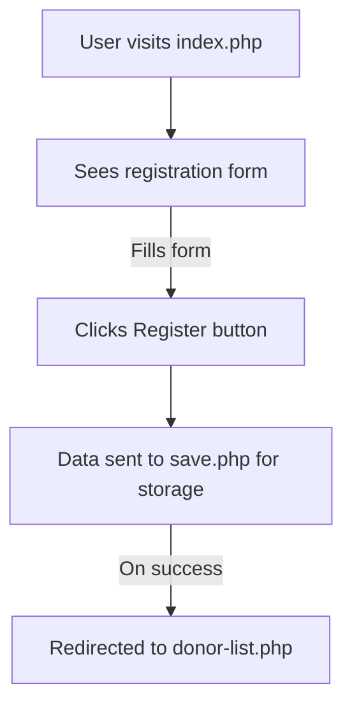
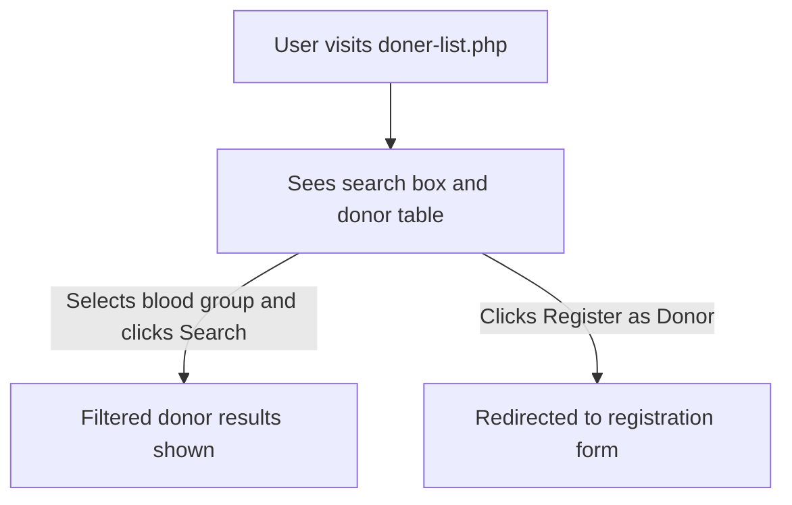
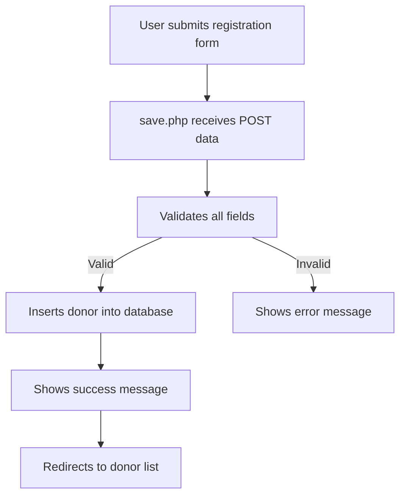
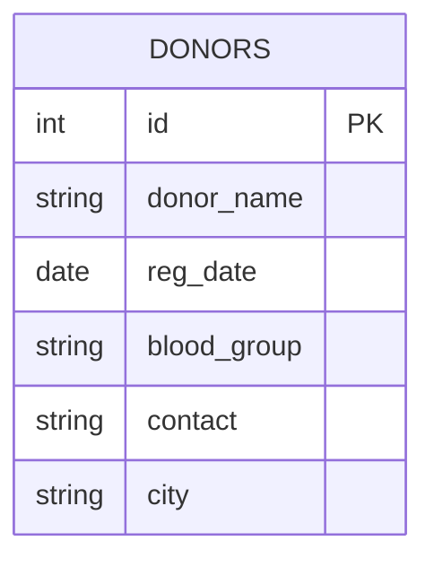
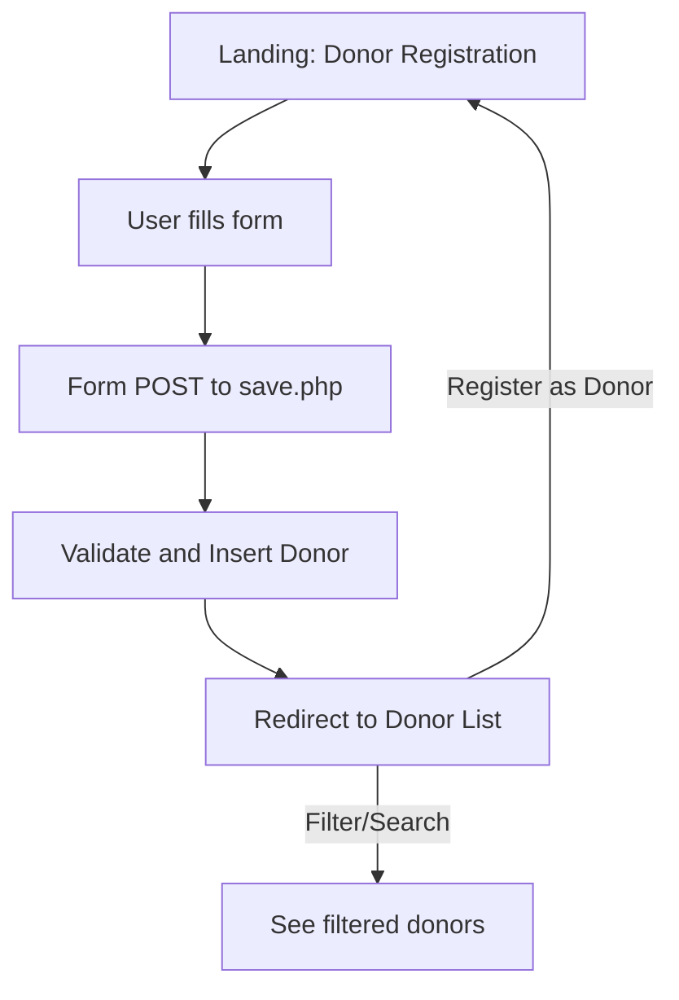

# Online Blood Banking System 🩸

This documentation will help you understand and use the "Online Blood Banking System" web application. You will learn how to register as a blood donor, search for available donors, and understand the backend logic that powers the system.

---

## Database Connection (`db.php`)

This file handles all database interactions by creating a connection to the MySQL database, which is essential for storing and retrieving donor information.

### What it Does

- Creates a connection to a configured MySQL database using the `mysqli` extension.
- Uses server-side configuration values for host, username, password, and database name.
- Stops the script and shows an error if the connection fails.

### Example Code

```php
<?php
// Example structure only, real credentials are not shown for security reasons.
$conn = new mysqli($dbHost, $dbUser, $dbPassword, $dbName);
if ($conn->connect_error) {
    die("Connection failed: " . $conn->connect_error);
}
```

### Key Points

- The `$conn` variable is used in other PHP files to communicate with the database.
- Actual database credentials are kept private and should never be exposed in documentation.

---

## Donor Registration Form (`index.php`)

This file presents the main interface for users to register as blood donors.

### What it Does

- Displays a stylish, user-friendly form for donor registration.
- Collects important donor information: Name, Registration Date, Blood Group, Contact Number, and City.
- On submission, sends data using the POST method to `save.php` for processing.

### User Interface

| Field         | Type         | Validation                                        |
|---------------|--------------|---------------------------------------------------|
| Name          | Text         | Required, minimum 3 characters                    |
| Date          | Date Picker  | Required                                          |
| Blood Group   | Dropdown     | Required, must select from available groups       |
| Contact       | Tel          | Required, exactly 10 digits, numbers only         |
| City          | Text         | Required, minimum 3 characters                    |

### Visual Style

- Clean, centered layout.
- Red and blue button options for "Register" and "View Donor List".

### User Flow



### How to Use

1. Go to the registration page.
2. Fill in all required fields.
3. Click "Register" to submit your details.
4. Use the "Donor List" button to view all registered donors.

---

## Donor List and Search (`doner-list.php`)

This file provides a searchable, tabular view of all registered blood donors.

### What it Does

- Retrieves donor records from the `donors` table in the database.
- Supports filtering by blood group using a dropdown and search button.
- Displays all donors (or filtered donors) in a responsive HTML table.
- Allows users to return to the registration form with a button.

### Interface Features

- **Search Box**: Lets users filter the donor list by specific blood group.
- **Donor List Table**: Shows ID, Name, Blood Group, Contact, Registration Date, and City.
- **Register Button**: Navigates users to the registration form.

### Table Columns

| Column           | Description                   |
|------------------|------------------------------|
| ID               | Serial number in table        |
| Name             | Donor's full name             |
| Blood Group      | Donor's blood type            |
| Contact          | Phone number                  |
| Date             | Registration date             |
| City             | Donor's city                  |

### How Filtering Works

- When a blood group is selected and "Search" is clicked, only donors with that blood group appear.
- If no filter is selected, all donors are displayed, sorted by newest first.

### Data Retrieval Logic

```php
if (isset($_GET['blood_group']) && !empty($_GET['blood_group'])) {
    // Secure search by blood group
    $stmt = $conn->prepare("SELECT * FROM donors WHERE blood_group = ?");
    $stmt->bind_param("s", $blood_group);
    $stmt->execute();
    $result = $stmt->get_result();
} else {
    // Show all donors
    $sql = "SELECT * FROM donors ORDER BY id DESC";
    $result = $conn->query($sql);
}
```

### User Flow



---

## Donor Registration Processing (`save.php`)

This backend script processes donor registration form submissions securely.

### What it Does

- Receives POST data from the registration form.
- Validates all required fields.
- Inserts a new donor record into the `donors` table using a **prepared statement** (protects against SQL injection).
- Displays a success or error message.
- Redirects users back to the donor list after processing.

### Main Logic

```php
if ($_SERVER["REQUEST_METHOD"] == "POST") {
    // Collect and validate data
    // Prepare insert statement
    // Execute and give feedback
}
header("Location: doner-list.php");
exit();
```

### Flow Diagram



---

## API Endpoints

The app primarily uses form submissions, but you can also interact with the backend endpoints directly if needed.

### Donor Registration (POST /save.php)

#### Endpoint: Register a new donor

```api
{
    "title": "Register New Donor",
    "description": "Registers a new blood donor in the system.",
    "method": "POST",
    "baseUrl": "http://localhost",
    "endpoint": "/save.php",
    "headers": [],
    "queryParams": [],
    "pathParams": [],
    "bodyType": "form",
    "requestBody": "name=John%20Doe&date=2024-06-10&blood_group=A%2B&contact=1234567890&city=Springfield",
    "formData": [
        { "key": "name", "value": "Full Name", "required": true },
        { "key": "date", "value": "Registration Date", "required": true },
        { "key": "blood_group", "value": "Blood Group (e.g., A+)", "required": true },
        { "key": "contact", "value": "Contact Number", "required": true },
        { "key": "city", "value": "City", "required": true }
    ],
    "responses": {
        "200": {
            "description": "Registration Success",
            "body": "Donor Registered Successfully!"
        },
        "400": {
            "description": "Missing Fields/Error",
            "body": "All fields are required!"
        }
    }
}
```

---

### Donor List (GET /doner-list.php)

#### Endpoint: List or search donors

```api
{
    "title": "List/Search Donors",
    "description": "Retrieves donor records, optionally filtered by blood group.",
    "method": "GET",
    "baseUrl": "http://localhost",
    "endpoint": "/doner-list.php",
    "headers": [],
    "queryParams": [
        { "key": "blood_group", "value": "Blood Group (A+, O-, etc.)", "required": false }
    ],
    "pathParams": [],
    "bodyType": "none",
    "requestBody": "",
    "formData": [],
    "responses": {
        "200": {
            "description": "HTML page with donor table",
            "body": "<table>...</table>"
        }
    }
}
```

---

## Data Model

Below is the basic structure of the `donors` table used by the system:

| Field        | Type    | Description                |
|--------------|---------|---------------------------|
| id           | INT     | Primary key, auto-increment|
| donor_name   | VARCHAR | Donor's full name          |
| reg_date     | DATE    | Registration date          |
| blood_group  | VARCHAR | Donor's blood group        |
| contact      | VARCHAR | Donor's contact number     |
| city         | VARCHAR | Donor's city               |

---



---

## Application Flow Overview

This system guides users from registration to donor listing in a secure, user-friendly manner.



---

## Security Considerations

- Prepared statements are used to prevent SQL injection.
- Field validation ensures data integrity.
- Error messages are shown for missing or invalid data.

---

```card
{
    "title": "Best Practice",
    "content": "Always use prepared statements and validation for any user-supplied data to maintain security."
}
```

---

## Getting Started as a User

1. Open the registration page and enter your details.
2. Submit your information to become a donor.
3. Visit the donor list to find donors by their blood group.

---

### Need Assistance?

If you have questions or run into issues, please contact your system administrator.

---

**Enjoy using the Online Blood Banking System!**